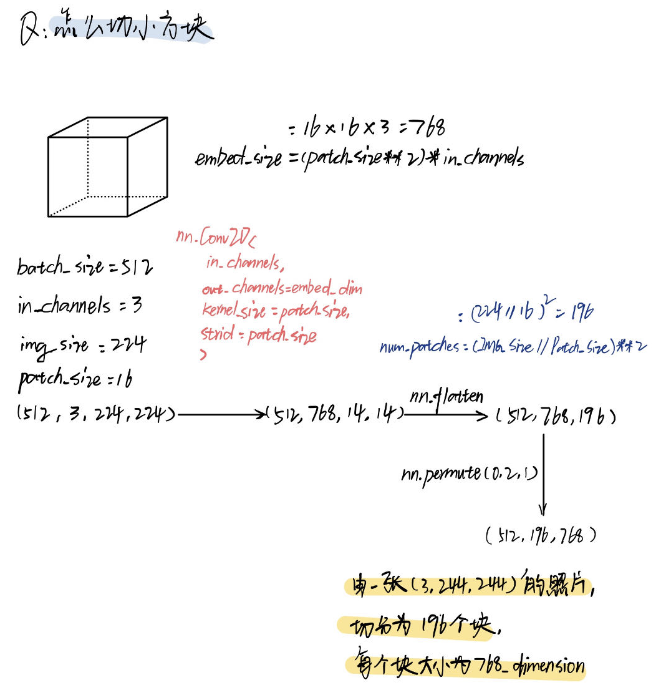

## Why ViT
The proposed attention mechanism can guide a Vision Transformer to become more attentive towards important appearance, color and texture features of an image.

### ViT Structure

### How to Patch

## Why FLAME
Faces Learned with an Articulated Model and Expressions
The model is trained from over 33, 000 scans.
    
https://flame.is.tue.mpg.de/

github: https://github.com/soubhiksanyal/FLAME_PyTorch/
### Parametrization of Flame

### Flame的表示
FLAME uses standard vertex based linear blend skinning (LBS) with corrective blendshapes, with N = 5023 vertices, K = 4 joints (neck, jaw, and eyeballs), and blendshapes, which will be learned from data.

### Blendshape?
将Blendshape理解为一个方法，FLAME这类参数化模型可以让人脸的各个属性解耦合，Blendshape的输入为每个属性的值，输出为对应人脸模型怎么发生形变的，)=5023个顶点发生的偏移量

